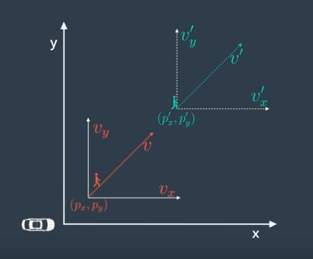
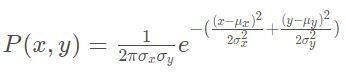

# Localization of a Kidnapped Vehicle

## Pipeline
The goal is to successfully localize a kidnapped vehicle using map of this location, a (noisy) GPS estimate of its initial location, and lots of (noisy) sensor and control data. In this project, a 2 dimensional particle filter is implemented in C++. 

[Udacity's simulator environment](https://github.com/udacity/self-driving-car-sim/) is used to create a map and some initial localization information (analogous to what a GPS would provide). At each time step the environment also sends observation and control data. The particle filter and simulator communicates using WebSocket.

The particle filter needs to be accurate and should localize vehicle position and yaw to within tolerance values. Also, it needs to perform localization in realtime and the minimum threshold for predictions per second is 24Hz.

## Particle Filter
The particle filter based localization algorithm can be summed up in the following visual.

The major steps are explained as follows:
1. A noisy measurement from GPS sensor was received and used to initialize the position of vehicle. This measurement included the x coordinate, y coordinate (both in m) and the theta (orientation) of vehicle in radian. Noise is modelled by Gaussian distribution with standard deviation in x, y and theta provided as a part of GPS uncertainty specification.
Particle filter algorithm uses particles to represent the location of vehicle. Hence, in this case, 20 particles were created and initialized to locations taken from normal distribution with mean equal to the location received from GPS and standard deviation equal to the GPS measurement uncertainty. The number of particles was a tunable parameter and was chosen after multiple iterations described in later steps of implementation.
  
2. Global map of environment is initialized. This map is represented by a list x and y coordinates of landmarks in the environment.
  
3. Once map and particles are initialized, the vehicle implements **Prediction** step in which the location of each particle at next time step is predicted. This is done by using information of control inputs and time elapsed between time steps. The control inputs are nothing but magnitude of velocity (v) and yaw rate (θ). Location update is done with the help of formula given below:
  

  
4. After prediction step, the vehicle implements **Update** step. In this step, particles are assigned with weights corresponding to their prediction. The process is stated below:
  
    - The vehicle uses LIDAR to sense its distance from landmarks and predict the location of landmarks as observed. This is received as a list of x, y coordinates along with the noise mapped as standard deviation in X (σx) and Y (σy) axes. Since, the LIDAR sensor is installed on the robot, these observations are received in x, y coordinate axes relative to the direction of motion of vehicle. This is shown in the first figure below where X axis is in the direction of motion of the vehicle and Y axis is perpendicular to X axis to the left. In the second figure below, the landmarks are shown with annotations L1-L5. Observations recorded in vehicle's coordinates are annotated OBS1-OBS3. The ground truth of vehicle is shown in red while the prediction of location vehicle as derived by the particle is shown in blue.

    
    

    - To map the observations into global coordinate system, a transformation is done involving translation and rotation but no scaling. This is done by using Homogenous Coordinate Transformation given by the formula where xm, ym represent the transformed observation, xc, yc represent the observations in vehicle's coordinate system and xp, yp the location of particle in global map coordinate system.

    
  
    - All landmarks cannot be in the range of vehicle at a given point of time. This is determined by the range of LIDAR sensor. Hence, given the observations at a time, all probable landmarks in the range of a particle are determined. This step involves filtering of landmarks to retain only those which are in the range of the particle.
    
    - After landmarks are filtered, each observation is then mapped to a landmark using nearest neighbor algorithm. The nearest neighbor algorithm is implemented by calculating Euclidean distance between an observation and all landmarks. The landmark with lowest Euclidean distance is associated to the observation. Hence, multiple observations may be associated to a single landmark.
    
    - Once every observation is associated to a landmark, weight of the particle is calculated by using Multivariate Gaussian distribution. Since all observations are independent, the total weight of the particle is the product of probabilities calculated by Multivariate Gaussian formula for all observations associated to landmarks. Formula for calculation of individual probabilities is given below, where x and y is the observation and µx and µy are the coordinates of associated landmark. The final weight of particle is product of all probabilities.

    
   
    - The weight of particle is the measure of how close the particle is w.r.t. to the ground truth of vehicle. The higher the weight, the more accurate is the particle's prediction. Hence, at the end of each update step, 'resampling' of particles with replacement is done to remove highly improbable particles.
   
    - update steps above are run for every particle and weight of each particle is calculated.

6. After udapte, resampling of particles is done. Resampling involves retaining of particles with higher weight and crushing of particles with lower weight. Once resampling is done, the particle with highest weight is chosen. This particle gives most accurate prediction of vehicle's location.
   
7. The location provided by particle with highest weight is then compared with the ground truth and error in the system is calculated.
   
8. Once initialization, prediction, update and resampling is implemented, the program is run under testing and error in the system along with run time is noted. To get the best estimate of vehicle's position in real time, the number of particles is tuned and finalized.

## Results
Particle filter implemented was run on Udacity's simulator and its error and performance was noted. Below is the result with 20 particles. The car represents the ground truth while the blue cirlce is the prediction made by the particle filtes. As can be seen, the estimated location follows closely the actual position of the vehicle.

## Steps for building the project

### Dependencies

The project has the following dependencies:
- cmake >= 3.5
- make >= 4.1
- gcc/g++ >= 5.4
- Udacity's simulator.

For instructions on how to install these components on different operating systems, please, visit [Udacity's seed project](https://github.com/udacity/CarND-Kidnapped-Vehicle-Project).

### Running the project in Ubuntu

- Execute every step from `./install-ubuntu.sh`. This will install gcc, g++, cmake, make and uWebsocketIO API.
- Build and run project by running `./build.sh`.
- In case of error, manually build the project and run using:
    - `mkdir build && cd build`
    - `cmake ..`
    - `make`
- Run the Udacity simulator and check the results